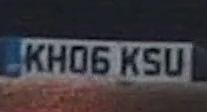
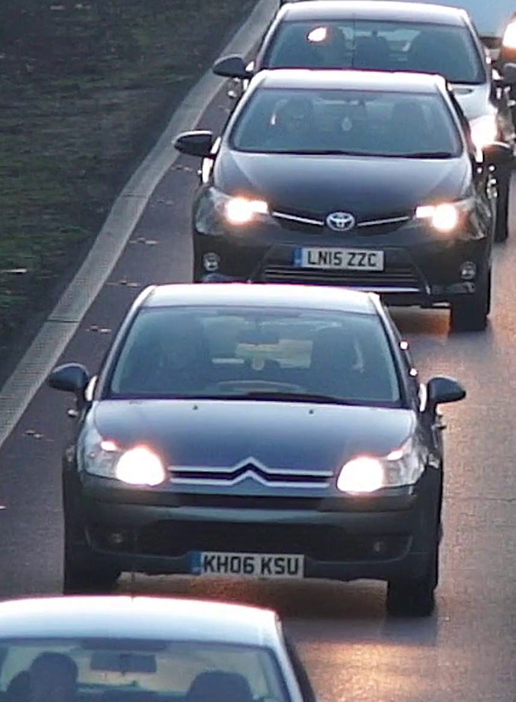
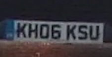
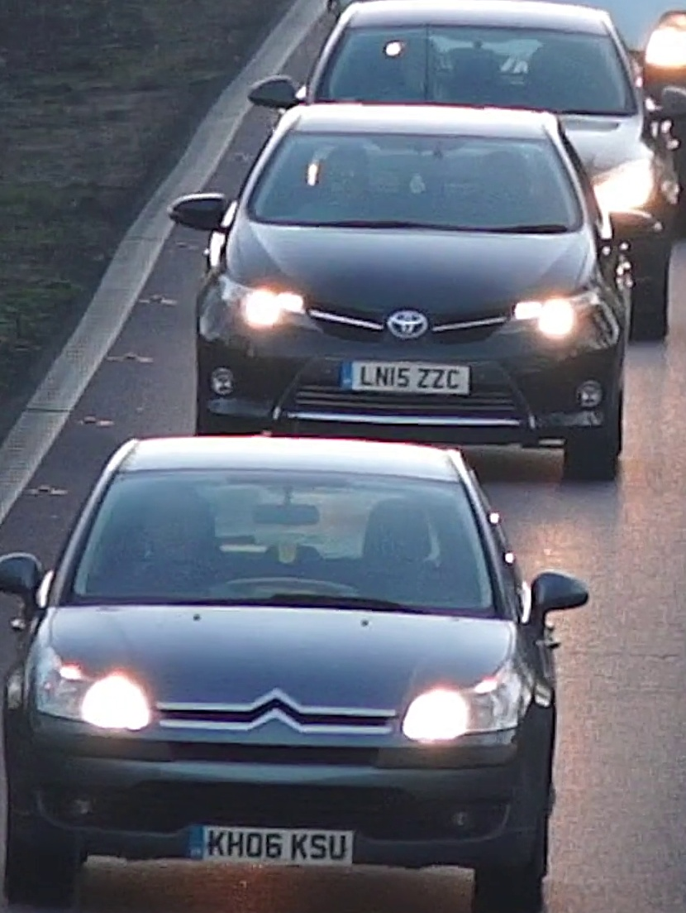
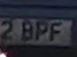
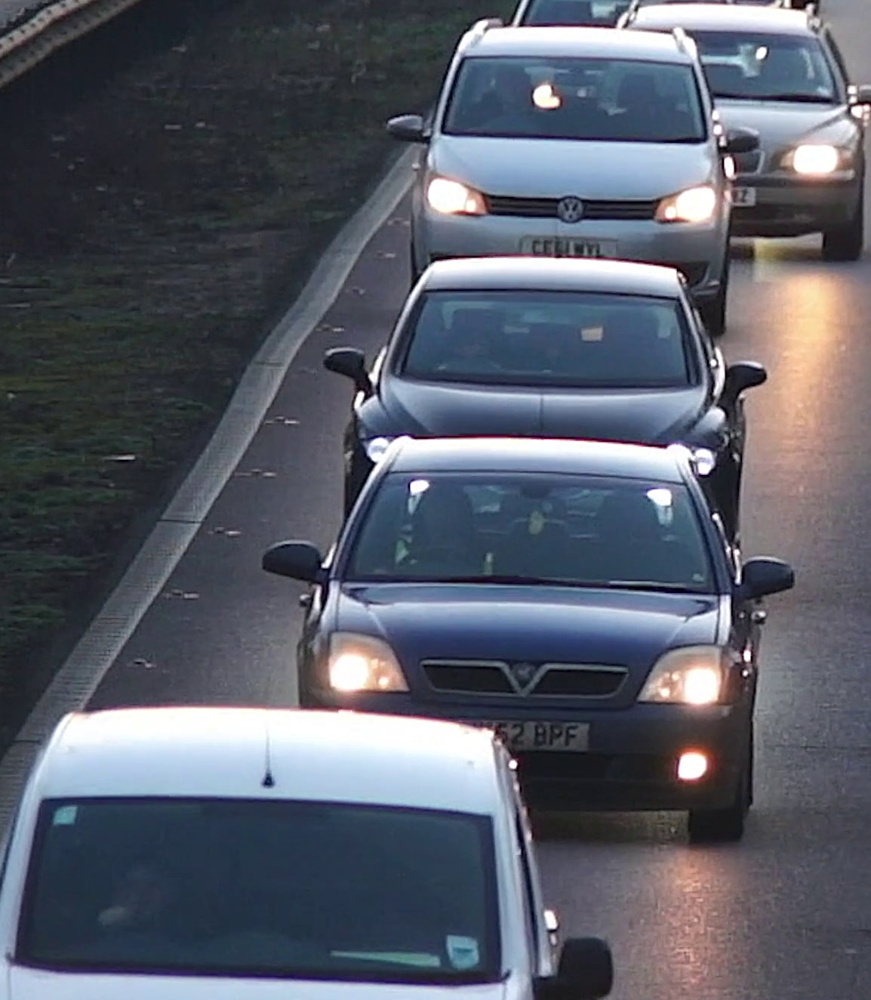
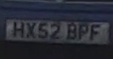
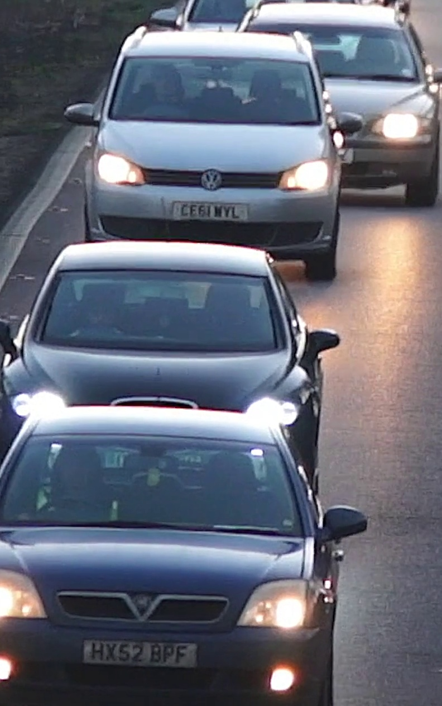

# Ambiguous Vehicle Pairs — Visual Ground-Truth Review Package

> [!IMPORTANT]
> **Objective**: Inspect the physical vehicle crops and plate crops for candidate ambiguous pairs to verify whether they represent the same physical vehicle or distinct vehicles.
> All checkboxes are left BLANK for manual verification.

## Pair 1: Track 55 vs. Track 73 (`KH06KSU` Sighting Collapse)
In `source.mp4`, a dark slate blue Citroën C4 hatchback passes through the intersection at ~24.4s–25.0s.
- **Track 73**: Best reading at `24.4s`, raw read `KHO6KSU` (conf=0.347), normalized to `KH06KSU`.
- **Track 55**: Best reading at `25.0s`, raw read `KH06KSU` (conf=0.563).

| Vehicle Track | Plate Crop | Vehicle Body Crop | Emitted Plate | Raw Read | Computed Type | Computed Color | Conf |
|---|---|---|---|---|---|---|---|
| `Track 73` (Early) |  |  | `KHO6KSU` | `KHO6KSU` | `car` | `blue` | `0.347` |
| `Track 55` (Late) |  |  | `KH06KSU` | `KH06KSU` | `car` | `blue` | `0.563` |

### Pair 1 Human Verification Checklist:
- [ ] **Same Physical Vehicle?** &nbsp;&nbsp; [ ] Yes &nbsp;&nbsp; [ ] No
- [ ] **Vehicle Type Confirmed**: [ ] Passenger Car &nbsp;&nbsp; [ ] Other: _____________
- [ ] **Body Color Confirmed**: [ ] Blue / Dark Blue &nbsp;&nbsp; [ ] Other: _____________
- [ ] **Resolution**: [ ] Merge into single trajectory &nbsp;&nbsp; [ ] Keep distinct

---

## Pair 2: Track 139 (`BPF`) vs. Track 138 (`HX52BPF`)
In `source.mp4`, a deep blue Vauxhall Vectra passes at ~50.8s–52.2s.
- **Track 139**: Partial low-confidence read `BPF` (conf=0.178) at frame edge.
- **Track 138**: Full high-confidence read `HX52BPF` (conf=0.614) in clear view.

| Vehicle Track | Plate Crop | Vehicle Body Crop | Emitted Plate | Raw Read | Computed Type | Computed Color | Conf |
|---|---|---|---|---|---|---|---|
| `Track 139` (Partial) |  |  | `BPF` | `BPF` | `car` | `blue` | `0.178` |
| `Track 138` (Full) |  |  | `HX52BPF` | `HX52BPF` | `car` | `blue` | `0.614` |

### Pair 2 Human Verification Checklist:
- [ ] **Same Physical Vehicle?** &nbsp;&nbsp; [ ] Yes &nbsp;&nbsp; [ ] No
- [ ] **Vehicle Type Confirmed**: [ ] Passenger Car &nbsp;&nbsp; [ ] Other: _____________
- [ ] **Body Color Confirmed**: [ ] Blue / Dark Blue &nbsp;&nbsp; [ ] Other: _____________
- [ ] **Resolution**: [ ] Merge into canonical plate `HX52BPF` &nbsp;&nbsp; [ ] Keep distinct
