# ANPR OCR Ground-Truth Manual Verification Package

> [!IMPORTANT]
> **Reviewer Instructions**: This document is an unvalidated manual review worksheet for all 35 vehicle tracks from `source.mp4`.
> Every row displays the actual cropped plate image extracted during inference, alongside the raw OCR read and post-normalization plate.
> **Do not modify pipeline outputs directly.** Check the appropriate boxes and record actual values if different.

### Review Status Summary
- **Total Vehicle Tracks Emitted**: 35
- **Verification Progress**: `0 / 35` completed (All checkboxes left unverified for human review)

---

| # | Track ID | Plate Crop | Raw OCR | Normalized Plate | Conf | Attempts | Offset / Timestamp | Matches Video? | Actual Plate (if different) | Readability | Reviewer Notes |
|---|---|---|---|---|---|---|---|---|---|---|---|
| 1 | `ID 139` |  | `BPF` | `BPF` | `0.178` | 5 | `50.800000` | [ ] Yes &nbsp; [ ] No | `_______________` | [ ] Clear   [ ] Marginal   [ ] Illegible | |
| 2 | `ID 147` | 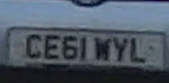 | `SC5506` | `SC5506` | `0.296` | 8 | `57.200000` | [ ] Yes &nbsp; [ ] No | `_______________` | [ ] Clear   [ ] Marginal   [ ] Illegible | |
| 3 | `ID 27` | 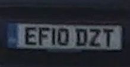 | `OU62HY` | `OU62HY` | `0.299` | 8 | `20.400000` | [ ] Yes &nbsp; [ ] No | `_______________` | [ ] Clear   [ ] Marginal   [ ] Illegible | |
| 4 | `ID 121` | 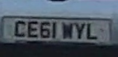 | `CE9NL` | `CE9NL` | `0.299` | 8 | `56.200000` | [ ] Yes &nbsp; [ ] No | `_______________` | [ ] Clear   [ ] Marginal   [ ] Illegible | |
| 5 | `ID 73` |  | `KHO6KSU` | **KHO6KSU** *(corrected)* | `0.347` | 2 | `24.400000` | [ ] Yes &nbsp; [ ] No | `_______________` | [ ] Clear   [ ] Marginal   [ ] Illegible | |
| 6 | `ID 137` | 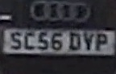 | `GIOSF` | `GIOSF` | `0.349` | 6 | `59` | [ ] Yes &nbsp; [ ] No | `_______________` | [ ] Clear   [ ] Marginal   [ ] Illegible | |
| 7 | `ID 149` | 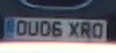 | `DDU06XRO` | `DDU06XRO` | `0.397` | 6 | `54.400000` | [ ] Yes &nbsp; [ ] No | `_______________` | [ ] Clear   [ ] Marginal   [ ] Illegible | |
| 8 | `ID 8` | 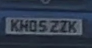 | `KHOSZZK` | **KH05ZZK** *(corrected)* | `0.450` | 8 | `04.800000` | [ ] Yes &nbsp; [ ] No | `_______________` | [ ] Clear   [ ] Marginal   [ ] Illegible | |
| 9 | `ID 78` |  | `EY09YUS` | `EY09YUS` | `0.462` | 8 | `29.800000` | [ ] Yes &nbsp; [ ] No | `_______________` | [ ] Clear   [ ] Marginal   [ ] Illegible | |
| 10 | `ID 6` | 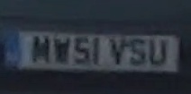 | `GXJ5` | `GXJ5` | `0.468` | 8 | `01.800000` | [ ] Yes &nbsp; [ ] No | `_______________` | [ ] Clear   [ ] Marginal   [ ] Illegible | |
| 11 | `ID 25` | 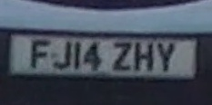 | `EYGINBG` | **EY61NBG** *(corrected)* | `0.478` | 8 | `09.800000` | [ ] Yes &nbsp; [ ] No | `_______________` | [ ] Clear   [ ] Marginal   [ ] Illegible | |
| 12 | `ID 114` | 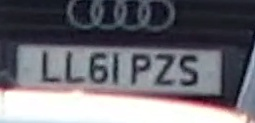 | `LL6IPZS` | **LL61PZS** *(corrected)* | `0.482` | 3 | `44.600000` | [ ] Yes &nbsp; [ ] No | `_______________` | [ ] Clear   [ ] Marginal   [ ] Illegible | |
| 13 | `ID 57` | 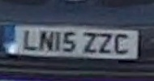 | `LNISZZC` | **LN15ZZC** *(corrected)* | `0.485` | 8 | `26` | [ ] Yes &nbsp; [ ] No | `_______________` | [ ] Clear   [ ] Marginal   [ ] Illegible | |
| 14 | `ID 1` | 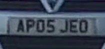 | `APOSJEO` | **AP05JEO** *(corrected)* | `0.498` | 8 | `05.200000` | [ ] Yes &nbsp; [ ] No | `_______________` | [ ] Clear   [ ] Marginal   [ ] Illegible | |
| 15 | `ID 65` | 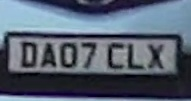 | `DAQ7CLX` | **DA07CLX** *(corrected)* | `0.499` | 8 | `29` | [ ] Yes &nbsp; [ ] No | `_______________` | [ ] Clear   [ ] Marginal   [ ] Illegible | |
| 16 | `ID 33` | 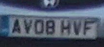 | `HNI4C` | `HNI4C` | `0.500` | 8 | `13.200000` | [ ] Yes &nbsp; [ ] No | `_______________` | [ ] Clear   [ ] Marginal   [ ] Illegible | |
| 17 | `ID 43` |  | `NA54KGJ` | `NA54KGJ` | `0.504` | 8 | `15.200000` | [ ] Yes &nbsp; [ ] No | `_______________` | [ ] Clear   [ ] Marginal   [ ] Illegible | |
| 18 | `ID 34` | 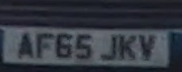 | `GJOSEPD` | **GJ05EPD** *(corrected)* | `0.510` | 8 | `23.600000` | [ ] Yes &nbsp; [ ] No | `_______________` | [ ] Clear   [ ] Marginal   [ ] Illegible | |
| 19 | `ID 109` | 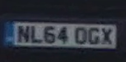 | `LPI4LJA` | **LP14LJA** *(corrected)* | `0.521` | 8 | `46.400000` | [ ] Yes &nbsp; [ ] No | `_______________` | [ ] Clear   [ ] Marginal   [ ] Illegible | |
| 20 | `ID 10` | 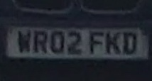 | `NRQ2FKD` | **NR02FKD** *(corrected)* | `0.531` | 8 | `09.200000` | [ ] Yes &nbsp; [ ] No | `_______________` | [ ] Clear   [ ] Marginal   [ ] Illegible | |
| 21 | `ID 19` | 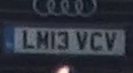 | `LHI3VCY` | **LH13VCY** *(corrected)* | `0.532` | 2 | `04.400000` | [ ] Yes &nbsp; [ ] No | `_______________` | [ ] Clear   [ ] Marginal   [ ] Illegible | |
| 22 | `ID 36` | 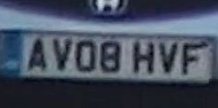 | `AYO8HVF` | **AY08HVF** *(corrected)* | `0.535` | 8 | `13.600000` | [ ] Yes &nbsp; [ ] No | `_______________` | [ ] Clear   [ ] Marginal   [ ] Illegible | |
| 23 | `ID 79` | 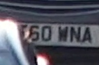 | `50WNA` | `50WNA` | `0.555` | 8 | `30.200000` | [ ] Yes &nbsp; [ ] No | `_______________` | [ ] Clear   [ ] Marginal   [ ] Illegible | |
| 24 | `ID 127` | 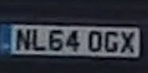 | `NL640GX` | **NL64OGX** *(corrected)* | `0.556` | 8 | `45.600000` | [ ] Yes &nbsp; [ ] No | `_______________` | [ ] Clear   [ ] Marginal   [ ] Illegible | |
| 25 | `ID 23` | 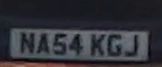 | `AK64DMV` | `AK64DMV` | `0.560` | 8 | `17.400000` | [ ] Yes &nbsp; [ ] No | `_______________` | [ ] Clear   [ ] Marginal   [ ] Illegible | |
| 26 | `ID 5` | 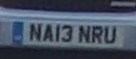 | `NSAISAN` | **NS41SAN** *(corrected)* | `0.563` | 8 | `00.200000` | [ ] Yes &nbsp; [ ] No | `_______________` | [ ] Clear   [ ] Marginal   [ ] Illegible | |
| 27 | `ID 55` |  | `KH06KSU` | `KH06KSU` | `0.563` | 5 | `25` | [ ] Yes &nbsp; [ ] No | `_______________` | [ ] Clear   [ ] Marginal   [ ] Illegible | |
| 28 | `ID 3` |  | `NAI3NRU` | **NA13NRU** *(corrected)* | `0.599` | 6 | `00.600000` | [ ] Yes &nbsp; [ ] No | `_______________` | [ ] Clear   [ ] Marginal   [ ] Illegible | |
| 29 | `ID 107` | 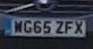 | `WG65ZFX` | `WG65ZFX` | `0.601` | 8 | `41` | [ ] Yes &nbsp; [ ] No | `_______________` | [ ] Clear   [ ] Marginal   [ ] Illegible | |
| 30 | `ID 51` | 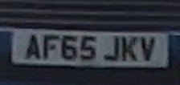 | `AF65JKV` | `AF65JKV` | `0.606` | 8 | `23` | [ ] Yes &nbsp; [ ] No | `_______________` | [ ] Clear   [ ] Marginal   [ ] Illegible | |
| 31 | `ID 16` | 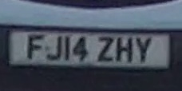 | `FJI4ZHY` | **FJ14ZHY** *(corrected)* | `0.610` | 8 | `09.600000` | [ ] Yes &nbsp; [ ] No | `_______________` | [ ] Clear   [ ] Marginal   [ ] Illegible | |
| 32 | `ID 138` |  | `HX52BPF` | `HX52BPF` | `0.614` | 4 | `52.200000` | [ ] Yes &nbsp; [ ] No | `_______________` | [ ] Clear   [ ] Marginal   [ ] Illegible | |
| 33 | `ID 61` | 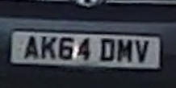 | `EFIODZT` | **EF10DZT** *(corrected)* | `0.629` | 8 | `18.400000` | [ ] Yes &nbsp; [ ] No | `_______________` | [ ] Clear   [ ] Marginal   [ ] Illegible | |
| 34 | `ID 11` |  | `BGG5USJ` | **BG65USJ** *(corrected)* | `0.631` | 8 | `15.400000` | [ ] Yes &nbsp; [ ] No | `_______________` | [ ] Clear   [ ] Marginal   [ ] Illegible | |
| 35 | `ID 97` |  | `BP63LYH` | `BP63LYH` | `0.641` | 8 | `38.400000` | [ ] Yes &nbsp; [ ] No | `_______________` | [ ] Clear   [ ] Marginal   [ ] Illegible | |

---
### Reviewer Sign-Off
- **Reviewer Name**: ___________________________
- **Review Date**: ___________________________
- **Total Validated Matches**: _____ / 35
- **Total Corrected Readings Confirmed**: _____
- **Notes / Edge Cases Observed**: ____________________________________________________________________
