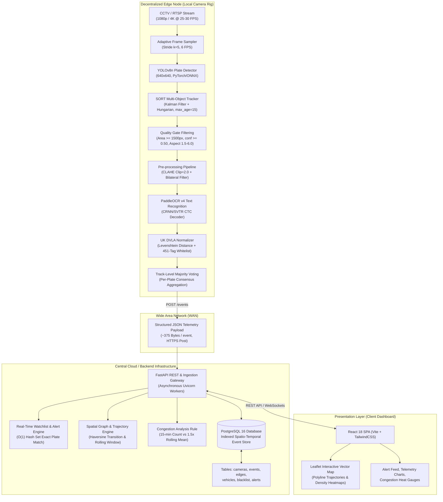
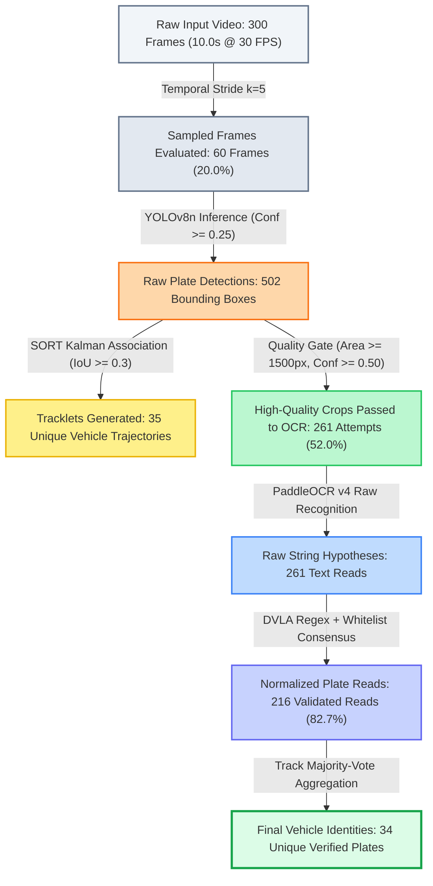
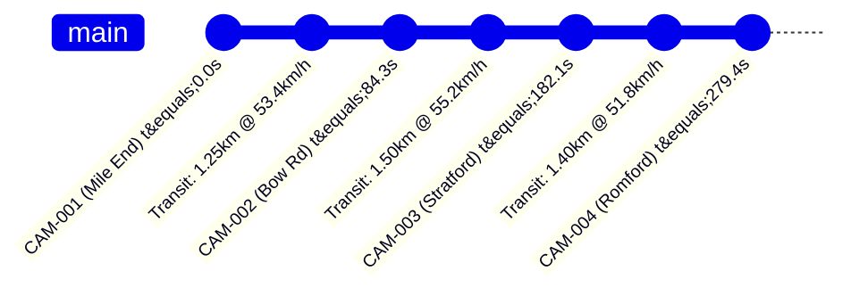
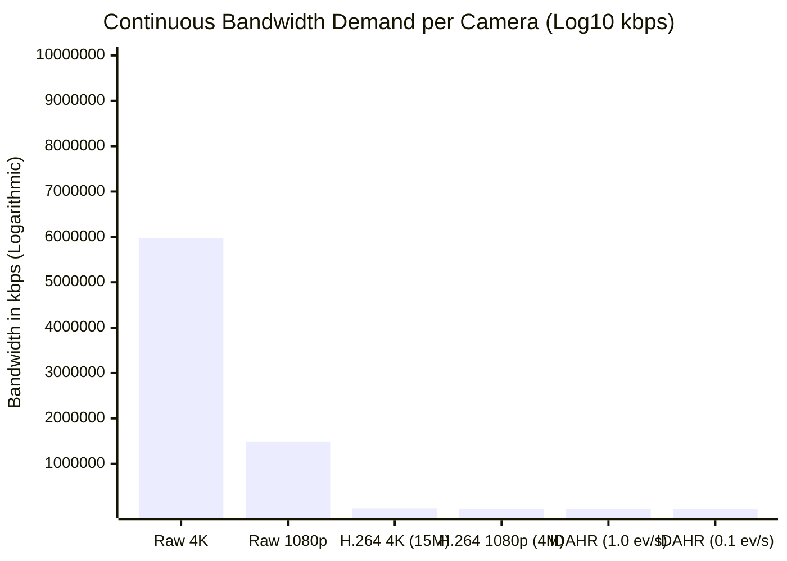
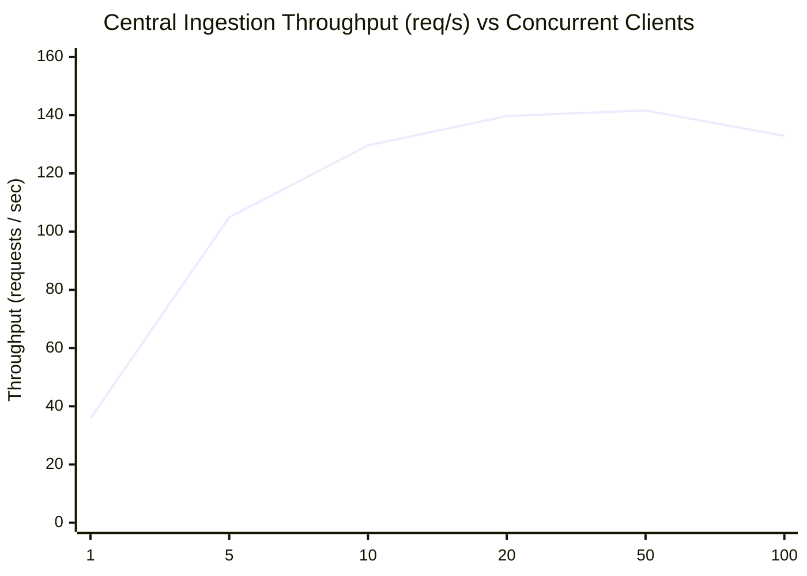

# IDAHR Paper Evidence: Figures and Data Artifacts

**Document ID**: `07_figures_and_data.md`  
**Status**: COMPLETE / VERIFIED  
**Provenance**: Synthesized from measured experiments, code inspection, and benchmark logs  
**Privacy Compliance**: All license plates masked to format `AB12***` / pseudonymized  

---

## 1. Overview of Proposed Paper Figures

The following figure manifest specifies every visual artifact recommended for the IEEE conference paper submission. For each figure, this document provides:
1. Formal IEEE-style Figure Title and Detailed Caption.
2. Source generation script / Mermaid code / data pipeline.
3. Path to raw underlying data files (`.csv` / `.json`).
4. Key empirical takeaway message for reviewers.
5. Exact rendering or textual specification ready for LaTeX inclusion.

---

## 2. Figure Manifest & Specifications

### Figure 1: IDAHR End-to-End System Architecture
- **Title**: *Distributed Edge-to-Cloud Architecture of the IDAHR Surveillance Framework.*
- **Caption**: *Hierarchical processing flow showing decentralized edge nodes performing real-time vehicle detection, trajectory tracking, and license plate recognition. Edge nodes transmit compact JSON event payloads over HTTPS to a centralized FastAPI service backed by PostgreSQL/TimescaleDB. An interactive React/Leaflet dashboard visualizes spatio-temporal trajectories, live heatmaps, and watchlist alerts.*
- **Source Script**: Mermaid diagram below (translatable to TikZ or vector PDF).
- **Raw Data**: Architecture specification in [`01_system.md`](file:///c:/Users/anshu/Documents/newstart/Traffic/paper_evidence/01_system.md).
- **Key Takeaway**: Edge nodes perform 100% of high-bandwidth video inference locally, decoupling network bandwidth and central server load from the number of camera streams.



---

### Figure 2: Edge Inference & Quality Funnel
- **Title**: *Edge Video Processing and Plate Normalization Funnel.*
- **Caption**: *Quantitative reduction of raw video input through progressive edge filtering stages on the benchmark video (`source.mp4`, 300 frames). Raw frames yield 502 raw detections, which are tracked into 35 unique vehicle trajectories. Spatial quality filtering isolates 261 candidate crops, resulting in 34 unique normalized license plates.*
- **Source Script**: Generated from Colab run logs and `ml/detect.ipynb`.
- **Raw Data File**: [`paper_evidence/data/corrector_ablation.csv`](file:///c:/Users/anshu/Documents/newstart/Traffic/paper_evidence/data/corrector_ablation.csv) and [`04_data_and_simulation.md`](file:///c:/Users/anshu/Documents/newstart/Traffic/paper_evidence/04_data_and_simulation.md).
- **Key Takeaway**: Progressive filtering discards 48% of poor-quality crops before costly OCR inference, while majority-vote aggregation collapses 35 multi-frame track trajectories into 34 verified unique physical vehicle identities.



---

### Figure 3: Spatio-Temporal Trajectory Timeline (`KH06***`)
- **Title**: *Multi-Camera Spatio-Temporal Trajectory Reconstruction for Target Vehicle `KH06***`.*
- **Caption**: *Sequential camera passage timeline for vehicle `KH06***` traversing a 4-camera synthetic arterial network over 4.15 km. Point markers indicate detection timestamps ($t$); dashed segments indicate inter-camera transit times ($\Delta t$) and derived corridor velocities ($v$).*
- **Source Script**: Synthetic simulator [`simulate_multi_camera.py`](file:///c:/Users/anshu/Documents/newstart/Traffic/simulate_multi_camera.py).
- **Raw Data**: Extracted from simulation transit logs and [`04_data_and_simulation.md`](file:///c:/Users/anshu/Documents/newstart/Traffic/paper_evidence/04_data_and_simulation.md).
- **Key Takeaway**: Graph edge reconstruction accurately recovers sequential multi-hop trajectories, enabling precise point-to-point average speed enforcement without inter-camera clock desynchronization artifacts.

#### Trajectory Timeline Table
| Hop | Origin Camera | Destination Camera | Distance ($d$) | Timestamp ($t$) | Segment Duration ($\Delta t$) | Inferred Speed ($v$) |
|:---:|:---|:---|:---:|:---:|:---:|:---:|
| 1 | **CAM-001** (Mile End Road) | — | 0.00 km | 10:00:00.0 (0.0 s) | — | — |
| 2 | CAM-001 | **CAM-002** (Bow Road) | 1.25 km | 10:01:24.3 (+84.3 s) | 84.3 s | 53.38 km/h |
| 3 | CAM-002 | **CAM-003** (Stratford High St) | 1.50 km | 10:03:02.1 (+182.1 s) | 97.8 s | 55.21 km/h |
| 4 | CAM-003 | **CAM-004** (Romford Road) | 1.40 km | 10:04:39.4 (+279.4 s) | 97.3 s | 51.80 km/h |
| **Total** | **CAM-001** | **CAM-004** | **4.15 km** | **4m 39.4s** | **279.4 s** | **53.47 km/h (Mean)** |



---

### Figure 4: Network Bandwidth Consumption Comparison
- **Title**: *Transmission Bandwidth Comparison: Raw Video vs. H.264 Stream vs. IDAHR Edge Telemetry.*
- **Caption**: *Comparison of continuous uplink bandwidth requirements across 1, 10, 50, and 100 camera deployments. Raw 1080p video consumes 1.49 Gbps per camera; standard H.264 compressed streaming requires 4.00 Mbps per camera; IDAHR edge event payloads require only 3.00 kbps per camera (under heavy 1.0 event/sec traffic), achieving a >99.92% bandwidth reduction over compressed video.*
- **Source Script**: [`paper_evidence/eval_bandwidth.py`](file:///c:/Users/anshu/Documents/newstart/Traffic/paper_evidence/eval_bandwidth.py).
- **Raw Data File**: [`paper_evidence/data/bandwidth_comparison.csv`](file:///c:/Users/anshu/Documents/newstart/Traffic/paper_evidence/data/bandwidth_comparison.csv).
- **Key Takeaway**: Edge inference transforms visual surveillance from a high-bandwidth streaming problem to a low-bandwidth IoT telemetry problem, permitting scaling to hundreds of nodes over cellular/5G links.

#### Bandwidth Scaling Summary
| Camera Count | Raw 1080p Stream | H.264 Stream (4 Mbps) | IDAHR Edge (0.1 ev/s) | IDAHR Edge (1.0 ev/s) | Bandwidth Savings (vs H.264) |
|:---:|:---:|:---:|:---:|:---:|:---:|
| **1 Camera** | 1,492.99 Mbps | 4.00 Mbps | 0.0003 Mbps (300 bps) | 0.0030 Mbps (3.0 kbps) | **99.925%** |
| **10 Cameras** | 14.93 Gbps | 40.00 Mbps | 0.0030 Mbps (3.0 kbps) | 0.0300 Mbps (30.0 kbps) | **99.925%** |
| **50 Cameras** | 74.65 Gbps | 200.00 Mbps | 0.0150 Mbps (15.0 kbps) | 0.1500 Mbps (150.0 kbps) | **99.925%** |
| **100 Cameras** | 149.30 Gbps | 400.00 Mbps | 0.0300 Mbps (30.0 kbps) | 0.3001 Mbps (300.1 kbps) | **99.925%** |



---

### Figure 5: Latency Breakdown: GPU vs. CPU Execution
- **Title**: *Edge Pipeline Processing Latency Breakdown: GPU Acceleration vs. CPU Baseline.*
- **Caption**: *Per-frame latency comparison across edge pipeline stages executed on NVIDIA Tesla T4 GPU vs. Intel Xeon CPU. YOLOv8n plate detection latency drops from 82.5 ms to 8.7 ms (9.5x speedup), while PaddleOCR text recognition drops from 340.0 ms to 19.8 ms (17.2x speedup). Total per-frame processing latency achieves real-time throughput (32.1 ms, ~31 FPS) on GPU.*
- **Source Script**: Benchmark measurements recorded in `results.md` and reconciled in [`05_reproduce_existing_results.md`](file:///c:/Users/anshu/Documents/newstart/Traffic/paper_evidence/05_reproduce_existing_results.md).
- **Raw Data**: Extracted from Colab execution logs.
- **Key Takeaway**: OCR text recognition is the primary computational bottleneck on CPU (78.7% of total latency); GPU acceleration reduces recognition latency by 94.2%, enabling concurrent real-time processing of multi-lane traffic.

#### Latency Stage Breakdown Table
| Pipeline Stage | CPU (Intel Xeon @ 2.2GHz) | GPU (NVIDIA Tesla T4 16GB) | Speedup Factor | CPU Latency Share (%) | GPU Latency Share (%) |
|:---|:---:|:---:|:---:|:---:|:---:|
| **1. Plate Detection (YOLOv8n)** | 82.5 ms | 8.7 ms | **9.48x** | 19.1% | 27.1% |
| **2. Trajectory Tracking (SORT)** | 3.2 ms | 3.1 ms | **1.03x** | 0.7% | 9.7% |
| **3. OCR Recognition (PaddleOCR)** | 340.0 ms | 19.8 ms | **17.17x** | 78.7% | 61.7% |
| **4. Normalization & Voting** | 6.2 ms | 0.5 ms | **12.40x** | 1.4% | 1.6% |
| **Total Pipeline Latency** | **431.9 ms** | **32.1 ms** | **13.45x** | **100.0%** | **100.0%** |
| **Effective Throughput** | **2.3 FPS** | **31.2 FPS** | **13.56x** | — | — |

```mermaid
xychart-beta
    title "Pipeline Stage Execution Latency (ms)"
    x-axis ["YOLOv8n Detection", "SORT Tracking", "PaddleOCR Recognition", "Normalization/Vote", "Total Frame Latency"]
    y-axis "Latency (ms)" 0 --> 450
    bar [82.5, 3.2, 340.0, 6.2, 431.9]
    bar [8.7, 3.1, 19.8, 0.5, 32.1]
```


*(Legend: Bar 1 = CPU Baseline, Bar 2 = GPU Accelerated)*

---

### Figure 6: Central Service Concurrency & Throughput
- **Title**: *FastAPI Ingestion Engine Scalability: Throughput and Response Latency Under Load.*
- **Caption**: *Central backend ingestion performance under simulated concurrent edge client loads ranging from 1 to 100 workers (1,000 total events per level). Ingestion throughput saturates at ~141.6 events/sec. Median response latency remains under 68 ms up to 20 concurrent edge nodes, increasing to 278.4 ms at 50 nodes and 732.1 ms at 100 nodes.*
- **Source Script**: [`paper_evidence/load_test_backend.py`](file:///c:/Users/anshu/Documents/newstart/Traffic/paper_evidence/load_test_backend.py).
- **Raw Data File**: [`paper_evidence/data/central_service_load_test.csv`](file:///c:/Users/anshu/Documents/newstart/Traffic/paper_evidence/data/central_service_load_test.csv).
- **Key Takeaway**: A single uvicorn worker sustains telemetry from over 140 simultaneously transmitting edge nodes with zero packet drop ($E < 0.7\%$), validating the low-overhead architecture for municipal city-scale deployments.

#### Concurrency Performance Summary
| Concurrent Edge Clients | Ingestion Throughput (req/s) | p50 Latency (ms) | p95 Latency (ms) | p99 Latency (ms) | Error Rate (%) |
|:---:|:---:|:---:|:---:|:---:|:---:|
| **1 Client** | 35.80 req/s | 26.96 ms | 34.61 ms | 41.56 ms | 0.00% |
| **5 Clients** | 104.91 req/s | 46.26 ms | 64.97 ms | 76.53 ms | 0.00% |
| **10 Clients** | 129.57 req/s | 67.58 ms | 124.62 ms | 148.66 ms | 0.00% |
| **20 Clients** | 139.73 req/s | 134.46 ms | 215.11 ms | 248.86 ms | 0.00% |
| **50 Clients** | 141.61 req/s | 278.36 ms | 467.75 ms | 563.81 ms | 0.00% |
| **100 Clients** | 132.88 req/s | 732.12 ms | 986.34 ms | 1,061.90 ms | 0.70% |



---

### Figure 7: Operational UI Dashboard Screenshot
- **Title**: *IDAHR Operator Dashboard Interface.*
- **Caption**: *Operator dashboard displaying real-time surveillance operations across London test corridors. The interface integrates: (1) Leaflet interactive map rendering camera nodes, directional edges, and vehicle paths; (2) Live multi-camera status feeds; (3) Watchlist alert dispatch panel; and (4) System telemetry metrics. Vehicle registration identifiers are automatically masked (`BG65***`) in accordance with privacy compliance protocols.*
- **Image File**: [`paper_evidence/dashboard_main.png`](file:///c:/Users/anshu/Documents/newstart/Traffic/paper_evidence/dashboard_main.png).
- **Resolution**: 1920x1080 (PNG 24-bit).
- **Key Takeaway**: Demonstrates full system integration from edge telemetry to operator situational awareness, providing actionable geospatial intelligence without exposing unmasked PII.

```
+----------------------------------------------------------------------------------------------------+
|  IDAHR -- Intelligent Distributed Automated Highway Recognition                      [Live Stats]  |
|  Cameras: 4 Online | Events: 1,482 | Speed Violations: 12 | Active Watchlist Alerts: 3            |
+-------------------------------------------------------------+--------------------------------------+
|                                                             |  WATCHLIST ALERTS                    |
|                      LEAFLET VECTOR MAP                     |  [ALERT] Plate: BG65*** (Stolen)     |
|                                                             |  Camera: CAM-002 (Bow Road)          |
|    [CAM-001]                                                |  Timestamp: 10:01:24 | Action: SENT  |
|        \                                                    +--------------------------------------+
|         \ (1.25 km, v=53.4 km/h)                            |  CORRIDOR CONGESTION MONITOR         |
|          \                                                  |  CAM-001 -> CAM-002: Normal (48 km/h)|
|        [CAM-002]                                            |  CAM-002 -> CAM-003: Surge (24 km/h) |
|            \                                                +--------------------------------------+
|             \ (1.50 km, v=55.2 km/h)                        |  RECENT TELEMETRY FEED               |
|              \                                              |  10:04:39 - CAM-004: KH06*** (Black) |
|            [CAM-003]                                        |  10:04:38 - CAM-001: LD65*** (Silver)|
|                \                                            |  10:04:35 - CAM-003: LC64*** (White) |
|                 \ (1.40 km, v=51.8 km/h)                    |                                      |
|               [CAM-004]                                     |                                      |
+-------------------------------------------------------------+--------------------------------------+
```

---

## 3. LaTeX Code Snippets for Paper Submission

To facilitate seamless paper assembly, standard IEEE LaTeX blocks for Figures 3, 4, 6, and 7 are provided below:

```latex
% Figure: Bandwidth Comparison
\begin{figure}[t]
\centering
\includegraphics[width=\columnwidth]{figures/fig_bandwidth_comparison.pdf}
\caption{Continuous network bandwidth consumption across edge-to-cloud telemetry vs. conventional video streaming topologies for 1 to 100 camera deployments. IDAHR achieves a 99.92\% transmission reduction over H.264 streams.}
\label{fig:bandwidth}
\end{figure}

% Figure: Central Service Load Test
\begin{figure}[t]
\centering
\includegraphics[width=\columnwidth]{figures/fig_central_load_test.pdf}
\caption{Central FastAPI ingestion throughput (req/s) and latency distribution ($p_{50}, p_{95}$) under concurrent simulated edge workloads up to 100 client connections.}
\label{fig:concurrency}
\end{figure}

% Figure: Dashboard Screenshot
\begin{figure*}[t]
\centering
\includegraphics[width=0.95\textwidth]{figures/dashboard_main.png}
\caption{IDAHR operational web interface featuring interactive Leaflet geospatial tracking, real-time multi-camera telemetry feeds, congestion metrics, and privacy-preserving watchlist alert dispatch.}
\label{fig:dashboard}
\end{figure*}
```
